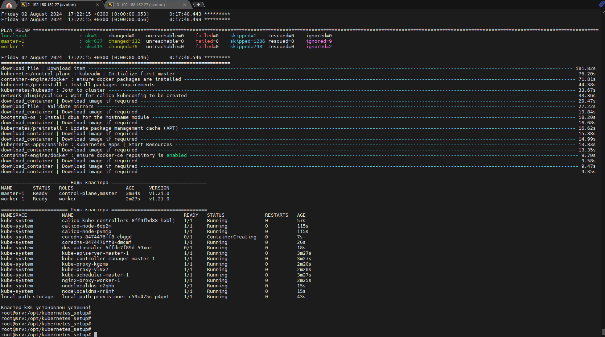

# Install k8s cluster with Kubespray on Yandex Cloud
# kubernetes_setup 

Вся подготовка по установке сервера управления srv, установки нужных пакетов и зависимостей, скачивание из репозиториев kubespay
и подготовка для установки кластера выполняется автоматически на предыдущем шаге кодом из репозитория: 
https://github.com/avolon/Initial_infr

Для полуавтоматического варианта установки, необходимо после установки сервара управления SRV:
```
  - зайти по ssh на эту ноду:  ssh -i /home/avolon/.ssh/avolon-skillfactory ubuntu@<IP_adress>
  - запустить скрипт развёртывания кластера k8s: /opt/kubernetes_setup/cluster_install.sh
```
В этом варианте только два ручных действия:
  - Развёртывание srv из заранее скачанного репозитория https://github.com/avolon/Initial_infr: terraform apply
  - Развёртывание кластера k8s с srv ноды: /opt/kubernetes_setup/cluster_install.sh

Для автоматического развёртывания понадобится:
```
  - раскомментировать в файле /scripts/k8s-provisioning.sh самую нижнюю строку: #/opt/kubernetes_setup/cluster_install.sh репозитория https://github.com/avolon/Initial_infr
  - Запуск автоматического каскадного развёртывания из заранее скачанного репозитория https://github.com/avolon/Initial_infr srv ноды и кластера k8s с неё: terraform apply
```

В примере использован первый вариант - полуавтоматический.

## Create cloud resources and install k8s cluster
```
$ /opt/kubernetes_setup/cluster_install.sh
```

## Delete cloud resources
```
$ /opt/kubernetes_setup/cluster_destroy.sh
```

Результаты разворачивания инфрастурктуры и кластера:


